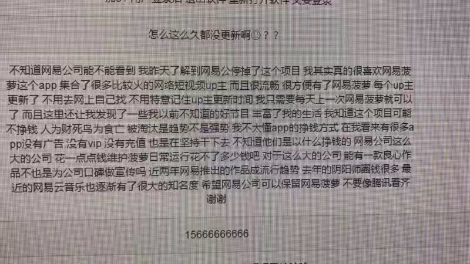

08年，大一下学期，在“程序设计基础”第一次课程上，于津老师问：程序员编程像什么？那时我回答说：如厨师做烹饪。而现在，我的想法依然没变：编程如小烹。

编程如小烹，当追求一个好的作品时，二者都需：

- 用心设计
- 细致实现

编程如小烹，二者也是有区别的。前者更关注作品本身，追求的是作品的极致；后者更关注作品和人，追求的是作品带给人的快乐。这微妙的区别，也是可以理解的。前者的作品面向的不一定是人，比如机器设备；后者的作品却一定是面向人。

这些年来，从事的都是客户端开发工作，所做作品都是面向于个人消费者用户。所以，在进行作品实现时，所追求的多是：希望所作能给用户带来快乐。幸运地是，的确有做到过，比如曾经参与的网易菠萝短视频APP——在项目即将停掉的时候，我们（那群可爱的菠萝团队成员们）在系统后台发现了菠萝粉丝给我们团队的留言和期待：

然而，回力乏天，这个项目终究是被停掉了。

